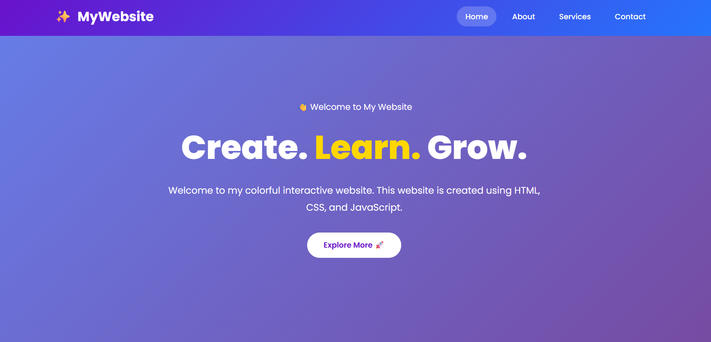
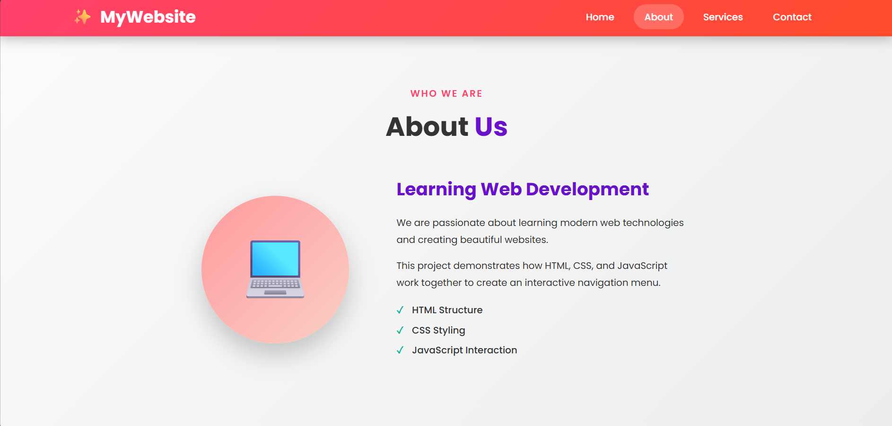
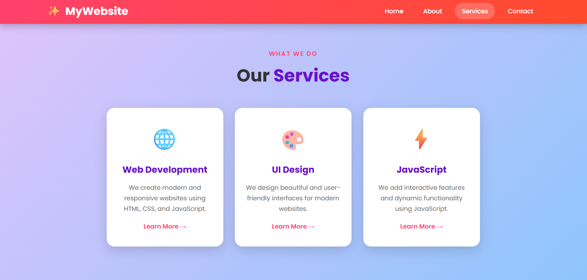

# 🌐 Responsive Webpage Project

## 📌 Project Overview

This project is a responsive and interactive webpage developed using **HTML**, **CSS**, and **JavaScript**. It demonstrates the fundamentals of front-end web development, including page structure, styling, responsive design, and user interaction.

## 🚀 Live Demo

👉 [View Live Project](https://devisushmabommisetti.github.io/PRODIGY_WD_01/)

## ✨ Features

* Responsive navigation bar
* Interactive hover effects
* Scroll-based navigation color change
* Clean and modern user interface
* Mobile-friendly responsive layout
* Well-organized and readable code

## 🛠️ Technologies Used

* HTML5
* CSS3
* JavaScript (ES6)

## 📂 Project Structure

```text
Webpage-Project/
│── index.html
│── style.css
│── script.js
│── images/
│── README.md
```

## 📖 What I Learned

Through this project, I gained practical experience with:

* HTML page structure
* CSS styling and layouts
* Flexbox
* Responsive web design
* JavaScript DOM manipulation
* Event handling
* Creating interactive navigation menus

## 🎯 Future Improvements

* Add a dark mode toggle
* Improve animations and transitions
* Add additional web pages
* Optimize performance
* Enhance accessibility

## 📸 Project Screenshots

### 🏠 Home Page



### 🧭 About Page



### 📱 Services Page




## 👩‍💻 Author

**Devisushma Bommisetti**

* B.Tech – Computer Science and Engineering
* Passionate about Web Development and Python Programming

## 📄 License

This project is created for learning and educational purposes. Feel free to use and modify it for your own practice.
